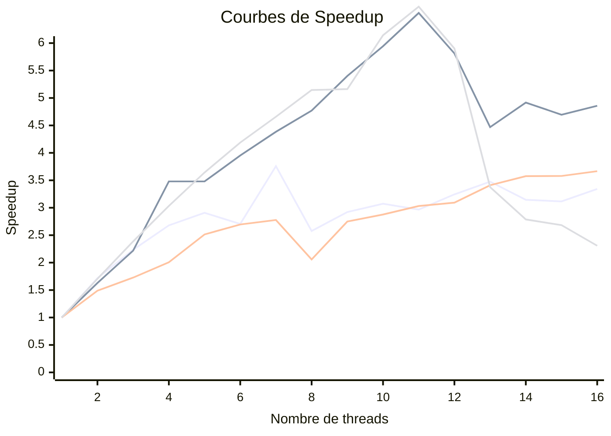

# TD1

`pandoc -s --toc README.md --css=./github-pandoc.css -o README.html`

## lscpu

*lscpu donne des infos utiles sur le processeur : nb core, taille de cache :*

```
Architecture :                              x86_64
Processeur(s) :                             16
  Liste de processeur(s) en ligne :         0-15
Identifiant constructeur :                  AuthenticAMD
  Nom de modèle :                           AMD Ryzen 7 7730U with Radeon Graphics
    Famille de processeur :                 25
    Modèle :                                80
    Thread(s) par cœur :                    2
    Cœur(s) par socket :                    8
    Socket(s) :                             1
    Révision :                              0
    CPU(s) scaling MHz:                     37%
    Vitesse maximale du processeur en MHz : 4546,0000
    Vitesse minimale du processeur en MHz : 400,0000
    BogoMIPS :                              3992,67
```


## Produit matrice-matrice

### Effet de la taille de la matrice

  n            | MFlops
---------------|--------
1023           | 1227.81
1024 (origine) | 209.367
1025           | 1276.12
1026           | 839.174
1027           | 913.185

*Explications des résultats :*

Problèmes de cache : l'ordre des opérations fait que on doit changer de coloner à chq opération, or matrices = lignes adjacentes dans notre mémoire => il faut jump de n.
cache < ram => utilise % une puissance de 2 (prob1024)
Du coup pour 1024 à chaque fois il faut charger un nouveau cache. Or comme on fait %1024, on supprime l'autre cache donc à chaque fois il faut remettre la ram dans le cache, alors que pour 1023 on ne supprime pas le cache

cache 4 coups d'horloge, ram en 100


### Permutation des boucles

*Expliquer comment est compilé le code (ligne de make ou de gcc) : on aura besoin de savoir l'optim, les paramètres, etc. Par exemple :*

```shell
make TestProduct.exe && ./TestProduct.exe 1024
g++ -fopenmp -std=c++14 -O3 -march=native -Wall -O2 -march=native -Wall  -c ProdMatMat.cpp -o ProdMatMat.o
g++ -fopenmp -std=c++14 -O3 -march=native -Wall -O2 -march=native -Wall  TestProductMatrix.o Matrix.hpp Matrix.o ProdMatMat.o -o TestProductMatrix.exe -lpthread
```

La ligne make permet d'exécuter la règle TestProduct.exe, qui crée le *.exe* de TestProduct si besoin (si le  fichier n'existe pas ou qu'il doit être mis à jour), puis lance le programme avec l'argument 1024.  
Les lignes suivantes découlent de la règle make. Les deux premières lignes permettent la construction des fichiers objets nécessaires (*-c*), en standard C++14, en likant OpenMP (grâce à *-fopenmp*), et les nomme avec leur nom en extension *.o*. L'option *-O3* permet de choisir un haut niveau d'optimisation, et *-march=native* optimise pour la machine sur laquelle on compile. Enfin, *-Wall* active tous les warnings.  
Ensuite, on link tous les fichiers objets pour produire l'exécutable, en ajoutant l'option *-lpthread* qui permet de linker la librairie pthread.


  ordre           | time    | MFlops    | MFlops(n=2048)
------------------|---------|-----------|----------------
i,k,j (origine)   | 11.0712 |   193.970 | 
j,i,k             |  4.2083 |   510.297 |
i,j,k             |  4.8839 |   439.7   |
k,i,j             | 10.312  |   208.251 |
j,k,i             |  0.1548 | 13871     |
k,j,i             |  0.1814 | 11832.6   |


*Discuter les résultats.*
On se place dans le pire cas, où à chaque changement de ligne le cache de la ligne précédente est supprimé, et soit une matrice carrée de taille n. Avec l'ordre *(j,k,i)*, *j* est modifié n fois, *k* n² fois et *i* n³ fois. Or, quand *i* change il suffit de lire dans le cache la valeur, quand *k* change il faire une mise en cache, et quand *k* change il faut faire deux mises en cache (sans compter d'éventuelles mises en cache si n est plus grand que le cache, car il y en aura autant pour les trois variables). Cet ordre permet donc de minimiser le nombre de mises en cache.


### OMP sur la meilleure boucle

`make TestProduct.exe && OMP_NUM_THREADS=8 ./TestProduct.exe 1024`

  OMP_NUM         | MFlops  | MFlops(n=2048) | MFlops(n=512)  | MFlops(n=4096)
------------------|---------|----------------|----------------|---------------
1                 | 12719.4 |    4574.04     |13189.2
2                 | 21854.3 |    7453.88     |19634.3
3                 | 28416.1 |   10146.5      |22780.2
4                 | 34066.6 |   13115.1      |26460.7
5                 | 36990.4 |   15915        |33155.6
6                 | 34403.3 |   18075.9      |35546.1
7                 | 47798.2 |   20052.1      |36624.1
8                 | 32767.4 |   21820.6      |27149.1
9                 | 37160.7 |   24701.2      |36263.4
10                | 39089.7 |   27187.2      |37942.7
11                | 37724.4 |   29957.5      |39979.3
12                | 41259.5 |   26584.6      |40790.6
13                | 44217.2 |   20443        |44973.1
14                | 40000.7 |   22486.4      |47159.7
15                | 39625.4 |   21477.2      |47202.7
16                | 42514.4 |   22222.1      |48352.9

*Tracer les courbes de speedup (pour chaque valeur de n), discuter les résultats.*
Afin d'avoir des résultats plus cohérents, les 16 essais sont lancés à la suite à l'aide d'une règle personnalisée dans le Makefile. Cependant, ces résultats sont toujours à relativiser car elles dépendent de paramètres hors de contrôle. On calcule ensuite l'accélération, $S = \frac{T_n}{T_1}$, avec $T_n$ le temps pour n threads.
```Makefile
run_tests_ProdMat: TestProductMatrix.exe
	@for i in $$(seq 0 16); do \
		echo "Running with OMP_NUM_THREADS=$$i"; \
		OMP_NUM_THREADS=$$i ./TestProductMatrix.exe $(n); \
    done
```



Légende : 
- 🟥 : n = 512
- 🟦 : n = 1024
- 🟩 : n = 2048
- 🟨 : n = 4096


La parallélisation permet d'accélérer l'exécution, allant parfois jusqu'à six fois la vitesse originale. On observe tout de même un volatilité (la vitesse n'est pas croissante selon les threads), mais dans tous les cas la parallélisation fait gagner du temps.  
Afin d'optimiser la vitesse d'exécution, il faut que la mise en cache se fasse dans un cache privé propre à chaque cœur. Hors, selon comment est effectuée la parallélisation, cela peut entraîner plusieurs mises en cache des mêmes données, qui n'auraient pas forcément été nécessaires. En s'assurant que la parallélisation s'effectue de la meilleure des manières, on peut s'assurer d'une exécution plus rapide.

### Produit par blocs

`make TestProduct.exe && ./TestProduct.exe 1024`

  szBlock         | MFlops   | MFlops(n=2048) | MFlops(n=512)  | MFlops(n=4096)
------------------|----------|----------------|----------------|---------------
origine (=max)    |  4620    |    26219.6     |    23889.8     |  9937.21
32                |  8724.45 |    6775.74     |     6294.85    |  10300.7
64                | 40820.6  |    12314.3     |     4223.09    |  20792.2
128               | 37856.7  |    31988.4     |     4895.12    |  17713.8
256               | 39587.9  |    47306.6     |     4874.5     |  27465.9
512               | 38742.6  |    42622       |    23889.8     |  36974.2
1024              |  4620    |    52633.1     |    .......     |  40335

*Discuter les résultats.*

Dans le cas de matrices de grand taille, le produit par bloc améliore généralement la vitesse d'exécution. Il semble que *n = 1024* soit la meilleure option en moyenne.


### Bloc + OMP


  szBlock      | OMP_NUM | MFlops  | MFlops(n=2048) | MFlops(n=512)  | MFlops(n=4096)|
---------------|---------|---------|----------------|----------------|---------------|
1024           |  1      | 12345.7 |    10431.8     |    12821.5     |    9685.09    |
1024           |  8      | 41113.9 |    45671.9     |    33581.8     |   43087.5     |
512            |  1      | 12903.8 |    12437.4     |    12867.6     |   10753.8     |
512            |  8      | 36740.7 |    45846.1     |    25610       |   43358.8     |

*Discuter les résultats.*
Le produit par bloc permet d'augmenter encore plus l'efficacité de la parallélisation. Il semble encore que 1024 soit la meilleure taille. On peut intuiter que le cache privé permet d'avoir 1024 entiers en mémoire. 

### Comparaison avec BLAS, Eigen et numpy

*Comparer les performances avec un calcul similaire utilisant les bibliothèques d'algèbre linéaire BLAS, Eigen et/ou numpy.*
  OMP_NUM      | MFlops linéaire, n = 2048 | MFlops BLAS, n = 2048|
---------------|---------------------------|----------------------|
1              |          11886.5          |       2968.87        |
2              |          19460.5          |       2956.66        |
3              |          24161.1          |       2969.73        |
4              |          26570.3          |       2922.37        |
5              |          30537.9          |       2950.27        |
6              |          30803.9          |       2979.36        |
7              |          36031.3          |       2964           |
8              |          33991.9          |       2957.47        |
9              |          33213.3          |       2963.81        |
10             |          35264.9          |       2995.91        |
11             |          37899.6          |       3074.07        |
12             |          39085.2          |       3060.63        |
13             |          41741.9          |       3075.08        |
14             |          41997.7          |       3061.89        |
15             |          31568.1          |       2948.19        |
16             |          23293.8          |       3064.48        |

Le programme linéaire, optimisé spécialement pour ma machine, est bien plus efficace. Cependant, à voir si cela serait vrai sur une autre machine.

# Tips

```
	env
	OMP_NUM_THREADS=4 ./produitMatriceMatrice.exe
```

```
    $ for i in $(seq 1 4); do elap=$(OMP_NUM_THREADS=$i ./TestProductOmp.exe|grep "Temps CPU"|cut -d " " -f 7); echo -e "$i\t$elap"; done > timers.out
```
